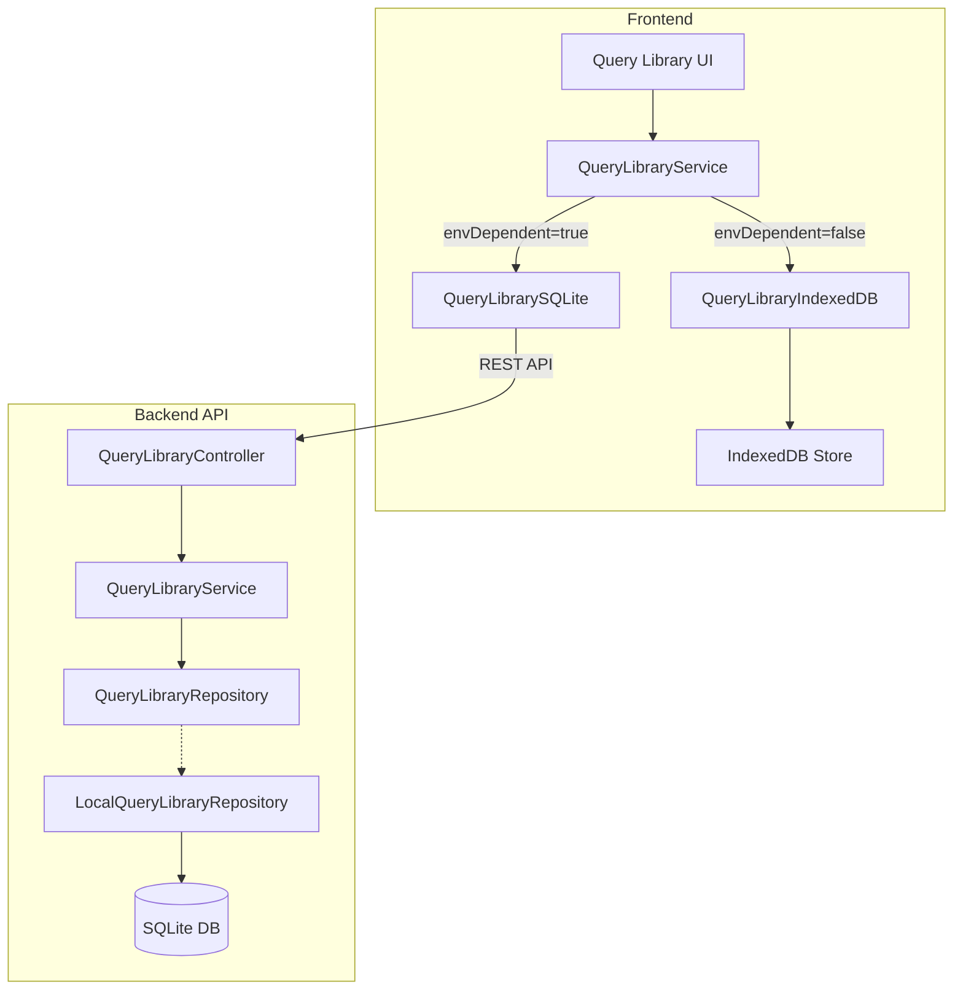

# Implementation Plan: RI-7927 Design API for Query Library

**JIRA Ticket:** [RI-7927](https://redislabs.atlassian.net/browse/RI-7927)
**Epic:** [RI-7947 Vector Search v2](https://redislabs.atlassian.net/browse/RI-7947)
**Plan Date:** 2026-02-20
**Planner:** Cursor Agent

---

## Executive Summary

Create a new `query-library` module (backend) and storage service (frontend) that follows the existing data-source agnostic pattern used by `CommandExecution`. The module stores both seeded sample queries and user-saved queries with full CRUD support, switching between SQLite and IndexedDB based on the `envDependent` feature flag.

**Components Affected:**

- Backend: New `redisinsight/api/src/modules/query-library/` module
- Frontend: New `redisinsight/ui/src/services/query-library/` service layer (no Redux -- service manages state directly)
- Database: New `query_library` SQLite table + migration
- Frontend: New IndexedDB object store for browser mode

**Key Risks:**

1. IndexedDB schema versioning conflicts with existing stores -- mitigated by using a separate IndexedDB database
2. Large binary blob data in sample queries (vector embeddings) -- mitigated by storing as-is in the `query` field for PoC
3. Ensuring consistent behavior between SQLite and IndexedDB adapters -- mitigated by shared interface contract and thorough testing

---

## 1. Requirements Summary

**Story (Why):**
We need a single "Query Library" storage layer so the Vector Search page can seed sample queries for sample datasets and allow users to save/edit/delete their own queries -- regardless of whether they're on Desktop (SQLite) or Browser/Cloud (IndexedDB).

**Acceptance Criteria:**

1. Data model defined with: id, databaseId, indexName, type (sample/saved), name, description, query, timestamps
2. CRUD API: create, list (with filters), update, delete
3. Seeding API to bulk-insert sample queries with duplicate prevention
4. Both SQLite and IndexedDB adapters implemented and functional
5. API documented (types/interfaces, storage schema, decisions)

**Non-Functional Requirements:**

- Data-source agnostic: UI code must not know which backend is in use
- Encryption at rest for query content (Desktop/SQLite mode)
- CASCADE delete when parent database connection is removed
- Delete associated queries when an index is deleted (via FT.DROPINDEX or UI)

---

## 2. Current State Analysis

### Existing Pattern to Follow

The `CommandExecution` module provides the exact pattern we replicate:

**Backend (SQLite):**

- Abstract repository: `[command-execution.repository.ts](redisinsight/api/src/modules/workbench/repositories/command-execution.repository.ts)`
- Local implementation: `[local-command-execution.repository.ts](redisinsight/api/src/modules/workbench/repositories/local-command-execution.repository.ts)`
- Entity: `[command-execution.entity.ts](redisinsight/api/src/modules/workbench/entities/command-execution.entity.ts)`
- Module registration: `[workbench.module.ts](redisinsight/api/src/modules/workbench/workbench.module.ts)` with `DynamicModule` + `register()` pattern

**Frontend (Storage layer):**

- Interface: `[interface.ts](redisinsight/ui/src/services/commands-history/database/interface.ts)`
- SQLite adapter: `[CommandsHistorySQLite.ts](redisinsight/ui/src/services/commands-history/database/CommandsHistorySQLite.ts)` -- calls REST API
- IndexedDB adapter: `[CommandsHistoryIndexedDB.ts](redisinsight/ui/src/services/commands-history/database/CommandsHistoryIndexedDB.ts)`
- Service with adapter selection: `[commandsHistoryService.ts](redisinsight/ui/src/services/commands-history/commandsHistoryService.ts)` -- uses `envDependent` feature flag
- IndexedDB wrapper: `[workbenchStorage.ts](redisinsight/ui/src/services/workbenchStorage.ts)`

### Sample Queries (to migrate)

Currently hardcoded in the deprecated Vector Search page:

- `[saved-queries.tsx](redisinsight/ui/src/pages/vector-search-deprecated/saved-queries/saved-queries.tsx)` -- `{ [indexName]: [{ label, value }] }` for bikes and movies datasets

### Query Library UI Placeholder

Already exists in the new Vector Search editor:

- `[QueryEditorWrapper.tsx](redisinsight/ui/src/pages/vector-search/components/query-editor/QueryEditorWrapper.tsx)` -- placeholder div at line 90-95
- `[EditorLibraryToggle.tsx](redisinsight/ui/src/pages/vector-search/components/query-editor/EditorLibraryToggle.tsx)` -- tab toggle between Editor and Library

---

## 3. Data Model

```typescript
enum QueryLibraryType {
  Sample = "sample",
  Saved = "saved",
}

interface QueryLibraryItem {
  id: string; // UUID, auto-generated
  databaseId: string; // FK to database_instance
  indexName: string; // e.g. "idx:bikes_vss"
  type: QueryLibraryType; // query origin
  name: string; // display name
  description?: string; // required for sample, optional for saved
  query: string; // the actual query string
  createdAt: Date;
  updatedAt: Date;
}
```

---

## 4. API Design

### REST Endpoints (Backend)

| Method | Endpoint                                | Description                                      |
| ------ | --------------------------------------- | ------------------------------------------------ |
| POST   | `/databases/:id/query-library`          | Create a query                                   |
| GET    | `/databases/:id/query-library`          | List queries (filter: `?indexName=...&type=...`) |
| GET    | `/databases/:id/query-library/:queryId` | Get single query                                 |
| PATCH  | `/databases/:id/query-library/:queryId` | Update a query                                   |
| DELETE | `/databases/:id/query-library/:queryId` | Delete a single query                            |
| POST   | `/databases/:id/query-library/seed`     | Bulk seed sample queries (with duplicate check)  |

**Deletion strategy:**

- **Single query:** `DELETE /:queryId` endpoint (exposed to UI)
- **Index dropped:** `RedisearchService.deleteIndex()` internally calls `QueryLibraryService.deleteByIndex(databaseId, indexName)` -- no separate endpoint needed
- **Database removed:** FK CASCADE (SQLite) / clear-by-databaseId (IndexedDB) -- automatic

**Design decisions:**

- `indexName` is a **query filter** (not a URL path param) because: index names contain colons (e.g. `idx:bikes_vss`), and it allows listing across indexes if ever needed
- `databaseId` stays in the URL path since it scopes all operations
- No "delete by filter" endpoint -- bulk deletion is handled internally on index/database removal

---

## 5. Implementation Plan

### Phase 1: Backend Module

**Goal:** Full CRUD API with SQLite persistence

**Files to create:**

- `redisinsight/api/src/modules/query-library/query-library.module.ts`
- `redisinsight/api/src/modules/query-library/query-library.controller.ts`
- `redisinsight/api/src/modules/query-library/query-library.service.ts`
- `redisinsight/api/src/modules/query-library/entities/query-library.entity.ts`
- `redisinsight/api/src/modules/query-library/models/query-library.ts`
- `redisinsight/api/src/modules/query-library/models/query-library-type.enum.ts`
- `redisinsight/api/src/modules/query-library/dto/create-query-library-item.dto.ts`
- `redisinsight/api/src/modules/query-library/dto/update-query-library-item.dto.ts`
- `redisinsight/api/src/modules/query-library/dto/seed-query-library.dto.ts`
- `redisinsight/api/src/modules/query-library/dto/query-library-filter.dto.ts`
- `redisinsight/api/src/modules/query-library/repositories/query-library.repository.ts` (abstract)
- `redisinsight/api/src/modules/query-library/repositories/local-query-library.repository.ts`
- `redisinsight/api/migration/{timestamp}-query-library.ts`

**Files to modify:**

- `[redisinsight/api/config/ormconfig.ts](redisinsight/api/config/ormconfig.ts)` -- add `QueryLibraryEntity`
- `[redisinsight/api/migration/index.ts](redisinsight/api/migration/index.ts)` -- register migration
- `[redisinsight/api/src/app.module.ts](redisinsight/api/src/app.module.ts)` -- register `QueryLibraryModule`
- `[redisinsight/api/src/modules/browser/redisearch/redisearch.service.ts](redisinsight/api/src/modules/browser/redisearch/redisearch.service.ts)` -- inject `QueryLibraryService`, call `deleteByFilter` in `deleteIndex()`
- `[redisinsight/api/src/modules/browser/redisearch/redisearch.module.ts](redisinsight/api/src/modules/browser/redisearch/redisearch.module.ts)` -- import `QueryLibraryModule`

**Key implementation details:**

- Entity uses `@ManyToOne(() => DatabaseEntity, { onDelete: 'CASCADE' })` for cascade delete on database removal
- `ModelEncryptor` encrypts `query` and `description` fields
- Seed endpoint checks `indexName + type='sample'` to prevent duplicate seeding
- Abstract repository pattern allows swapping implementations via `DynamicModule.register()`
- Inject `QueryLibraryService` into `RedisearchService` (`[redisearch.service.ts](redisinsight/api/src/modules/browser/redisearch/redisearch.service.ts)`) so that `deleteIndex()` also calls `queryLibraryService.deleteByFilter(databaseId, { indexName })` to clean up associated queries when an index is dropped

### Phase 2: Frontend Storage Layer

**Goal:** Data-source agnostic service with both adapters

**Files to create:**

- `redisinsight/ui/src/services/query-library/database/interface.ts`
- `redisinsight/ui/src/services/query-library/database/QueryLibrarySQLite.ts`
- `redisinsight/ui/src/services/query-library/database/QueryLibraryIndexedDB.ts`
- `redisinsight/ui/src/services/query-library/queryLibraryService.ts`
- `redisinsight/ui/src/services/query-library/queryLibraryStorage.ts` (IndexedDB wrapper)
- `redisinsight/ui/src/services/query-library/index.ts`
- `redisinsight/ui/src/services/query-library/types.ts` (QueryLibraryItem interface and related types)

**Files to modify:**

- `[redisinsight/ui/src/constants/api.ts](redisinsight/ui/src/constants/api.ts)` -- add query-library API endpoints
- `[redisinsight/ui/src/slices/browser/redisearch.ts](redisinsight/ui/src/slices/browser/redisearch.ts)` -- call `queryLibraryService.deleteByFilter` in `deleteRedisearchIndexAction` on success

**Key implementation details:**

- No Redux -- `QueryLibraryService` is a plain class that manages adapter selection and delegates CRUD calls; UI components (RI-7932) will call it directly and manage local state with React hooks
- SQLite adapter calls REST API via `apiService`
- IndexedDB adapter uses a dedicated IndexedDB database (e.g. `RI_QUERY_LIBRARY_STORAGE`) to avoid conflicts
- Service class selects adapter via `envDependent` feature flag (same pattern as `CommandsHistoryService`)
- Wire index-deletion cleanup: in `deleteRedisearchIndexAction` (`[redisearch.ts](redisinsight/ui/src/slices/browser/redisearch.ts)`), call `queryLibraryService.deleteByFilter(databaseId, { indexName })` on success to remove associated queries from IndexedDB/API

### Phase 3: Sample Data Definition

**Goal:** Define sample queries in the new data model format

**Files to create:**

- `redisinsight/ui/src/pages/vector-search/constants/sample-queries/index.ts`
- `redisinsight/ui/src/pages/vector-search/constants/sample-queries/bikes.ts`
- `redisinsight/ui/src/pages/vector-search/constants/sample-queries/movies.ts`

**Key implementation details:**

- Restructure from `{ label, value }` to `{ name, description, query, indexName, type: 'sample' }`
- These constants will be used by the seed endpoint (wired in RI-7933)

---

## 6. Architecture Diagram



---

## 7. Testing Strategy

**Backend tests:**

- `query-library.service.spec.ts` -- unit tests for service logic (CRUD, seeding, duplicate prevention)
- `local-query-library.repository.spec.ts` -- repository tests with mocked TypeORM
- `query-library.controller.spec.ts` -- controller tests with mocked service

**Frontend tests:**

- `queryLibraryService.spec.ts` -- service adapter selection tests
- `QueryLibrarySQLite.spec.ts` -- API call tests
- `QueryLibraryIndexedDB.spec.ts` -- IndexedDB operation tests

**Edge cases:**

- Duplicate seeding prevention (same index seeded twice)
- Cascade delete when database is removed (FK CASCADE)
- Cascade delete when index is dropped (explicit deleteByFilter call)
- Encryption/decryption round-trip
- Empty query library for new database
- IndexedDB unavailability fallback

---

## 8. PR Stack

- **PR 1 (Backend):** New `query-library` module with entity, migration, CRUD API, seed endpoint, and tests
- **PR 2 (Frontend):** Storage service layer, IndexedDB adapter, SQLite adapter, sample data definitions, and tests

---

## 9. Decisions and Assumptions

- `**indexName` as query filter (not URL path param) -- avoids colons in URLs, keeps GET/DELETE consistent, allows cross-index listing
- **Separate IndexedDB database** for query library (not sharing with workbench history) to avoid version conflicts
- **Encryption** of `query` and `description` fields at rest (SQLite only, matching existing pattern)
- **No UI implementation** in this ticket (deferred to RI-7932)
- **Seeding wiring** (calling seed on index creation) deferred to RI-7933
- **Index-deletion cleanup** wired in this ticket: backend via `RedisearchService.deleteIndex()`, frontend via `deleteRedisearchIndexAction`
- **Database-deletion cleanup** handled by FK CASCADE (SQLite) and IndexedDB clear-by-databaseId
- **Sample query data** will include the full FT.SEARCH commands with embedded vector blobs
- **Query field stored as text** (not executed, just stored for later use)
