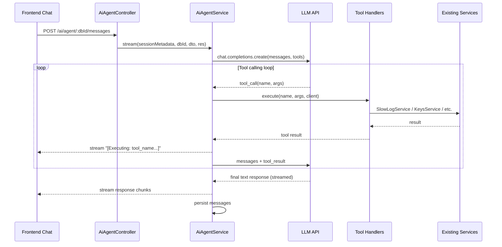

# Agentic Copilot MVP

## Architecture

Since we cannot modify the upstream Cloud Copilot Socket.IO service, we build a **self-contained agent loop** in the NestJS backend. It calls an LLM API directly (OpenAI-compatible) with function calling, executes tools by invoking existing RedisInsight services, and streams the final response to the frontend using the same HTTP streaming pattern the Assistance chat already uses.



## Key Design Decisions

- **LLM integration**: Use the `openai` npm package (compatible with OpenAI, Azure OpenAI, and many proxy services). Configured via env variables.
- **Streaming**: Reuse the same `res.write(chunk)` + `getStreamedAnswer` pattern from the existing chats. Tool execution status is streamed as markdown text (e.g., "> Fetching slow logs...") so existing `MarkdownMessage` rendering works with zero changes.
- **Tools**: Each tool is a plain function that receives a `RedisClient` + args and returns a string result. Registered in a map, dispatched by name.
- **UI placement**: Extend the Expert ("My Data") tab by adding an agent mode that uses the new endpoint when the `agentChat` feature flag is on, bypassing the cloud copilot Socket.IO flow entirely.

---

## Phase 1: Backend - AI Agent Module

### 1.1 Configuration

**File**: `redisinsight/api/config/default.ts`

Add to the `ai` config block:

```typescript
agent: {
  apiKey: process.env.RI_AI_AGENT_API_KEY || '',
  apiUrl: process.env.RI_AI_AGENT_API_URL || 'https://api.openai.com/v1',
  model: process.env.RI_AI_AGENT_MODEL || 'gpt-4o',
  maxToolRounds: parseInt(process.env.RI_AI_AGENT_MAX_TOOL_ROUNDS, 10) || 10,
},
```

### 1.2 New module structure

Create `redisinsight/api/src/modules/ai/agent/`:

```
agent/
├── ai-agent.module.ts
├── ai-agent.controller.ts
├── ai-agent.service.ts
├── providers/
│   └── ai-agent-llm.provider.ts      # OpenAI API wrapper
├── tools/
│   ├── ai-agent.tools.ts             # Tool registry + definitions
│   ├── run-command.tool.ts            # Execute Redis commands
│   ├── get-slow-logs.tool.ts          # Fetch slow logs
│   ├── get-database-overview.tool.ts  # Database overview/info
│   ├── scan-keys.tool.ts             # Scan and inspect keys
│   └── load-sample-data.tool.ts      # Import sample data
├── dto/
│   └── send.ai-agent.message.dto.ts
├── models/
│   └── ai-agent.common.ts            # Types, system prompt
└── exceptions/
    └── index.ts
```

### 1.3 Controller

**File**: `redisinsight/api/src/modules/ai/agent/ai-agent.controller.ts`

Mirrors the existing `ai-chat.controller.ts` pattern:

- `POST /ai/agent/:databaseId/messages` -- stream agent response (main endpoint)
- `GET /ai/agent/:databaseId/messages` -- get history
- `DELETE /ai/agent/:databaseId/messages` -- clear history

Uses `@ClientMetadataParam()` for database context, same as the existing AI query controller.

### 1.4 Service - Agent Loop

**File**: `redisinsight/api/src/modules/ai/agent/ai-agent.service.ts`

Core `stream()` method pseudocode:

```typescript
async stream(sessionMetadata, databaseId, dto, res: Response) {
  const client = await this.databaseClientFactory.getOrCreateClient({
    sessionMetadata, databaseId, context: ClientContext.AI,
  });
  const history = await this.messageRepository.list(sessionMetadata, databaseId);
  const messages = this.buildMessages(history, dto.content);

  let toolRounds = 0;
  while (toolRounds < MAX_TOOL_ROUNDS) {
    const completion = await this.llmProvider.chat(messages, TOOL_DEFINITIONS);

    if (completion.toolCalls?.length) {
      for (const call of completion.toolCalls) {
        res.write(`\n> Executing: **${call.name}**...\n\n`);
        const result = await this.toolRegistry.execute(call.name, call.args, client, sessionMetadata, databaseId);
        messages.push({ role: 'assistant', tool_calls: [call] });
        messages.push({ role: 'tool', tool_call_id: call.id, content: result });
      }
      toolRounds++;
    } else {
      // Final response - stream it
      for await (const chunk of completion.stream) {
        res.write(chunk);
      }
      break;
    }
  }

  // Persist question + answer
  await this.messageRepository.createMany(sessionMetadata, [question, answer]);
  res.end();
}
```

The actual implementation should use the OpenAI streaming API for the final response, while tool-calling rounds use non-streaming (to get the full tool call spec before executing).

### 1.5 LLM Provider

**File**: `redisinsight/api/src/modules/ai/agent/providers/ai-agent-llm.provider.ts`

Thin wrapper around the `openai` package:

```typescript
@Injectable()
export class AiAgentLlmProvider {
  private client: OpenAI;

  constructor() {
    this.client = new OpenAI({
      apiKey: aiConfig.agent.apiKey,
      baseURL: aiConfig.agent.apiUrl,
    });
  }

  async chatWithTools(messages, tools): Promise<ChatCompletion> { ... }
  async chatStream(messages): AsyncIterable<string> { ... }
}
```

### 1.6 Tool Definitions (MVP set)

**5 tools for the demo:**

| Tool                    | Wraps                                 | What it does                                                                                                              |
| ----------------------- | ------------------------------------- | ------------------------------------------------------------------------------------------------------------------------- |
| `run_redis_command`     | `RedisClient.sendCommand`             | Execute any Redis command. Args: `command: string` (full command string). Returns formatted result.                       |
| `get_database_overview` | `DatabaseInfoService.getOverview`     | Get version, memory, clients, ops/sec, key count. No args needed.                                                         |
| `get_slow_logs`         | `SlowLogService.getSlowLogs`          | Fetch slow log entries. Args: `count?: number` (default 25). Returns formatted slow log entries.                          |
| `scan_keys`             | `KeysService.getKeys`                 | Scan keys matching a pattern. Args: `match?: string`, `count?: number`, `type?: string`. Returns key names, types, sizes. |
| `load_sample_data`      | `BulkImportService.importDefaultData` | Load bundled Redis sample data into the database. No args.                                                                |

Each tool file exports: (a) the OpenAI function definition JSON, (b) an `execute(args, client, services)` function.

**System prompt** (in `ai-agent.common.ts`):

```
You are Redis Copilot, an AI assistant embedded in RedisInsight.
You are connected to a live Redis database. You can execute commands,
analyze performance, explore data, and help users manage their database.

When asked to do something, use the available tools to take action.
Always explain what you're doing and show relevant results.
For destructive operations (DEL, FLUSHDB, etc.), warn the user first.
```

### 1.7 Register the module

**File**: `redisinsight/api/src/app.module.ts` -- add `AiAgentModule` next to existing `AiChatModule` and `AiQueryModule.register()`.

### 1.8 New dependency

Add `openai` npm package to the project.

---

## Phase 2: Frontend Changes

### 2.1 Feature flag

**File**: `redisinsight/ui/src/constants/featureFlags.ts`

Add: `devAgentChat = 'dev-agentChat'`

This is a dev feature flag (prefixed `dev-`) to keep it behind a gate.

### 2.2 API endpoint constant

**File**: `redisinsight/ui/src/constants/api.ts`

Add: `AI_AGENT = 'ai/agent'`

### 2.3 Chat type enum

**File**: `redisinsight/ui/src/slices/interfaces/aiAssistant.ts`

Add `Agent = 'agent'` to the `AiChatType` enum. Add `agent` state shape to `StateAiAssistant` (mirrors `expert` shape).

### 2.4 Redux slice

**File**: `redisinsight/ui/src/slices/panels/aiAssistant.ts`

Add agent-specific reducers and thunks, mirroring the Expert chat pattern:

- `sendAgentQuestion`, `sendAgentAnswer`, `setAgentQuestionError`, `clearAgentChatHistory`
- `askAgentChatbotAction(databaseId, message, callbacks)` -- same streaming pattern as `askExpertChatbotAction` but hitting the `AI_AGENT` endpoint
- `getAgentChatHistoryAction`, `removeAgentChatHistoryAction`

### 2.5 Agent Chat component

**File**: `redisinsight/ui/src/components/side-panels/panels/ai-assistant/components/agent-chat/AgentChat.tsx`

Structure mirrors `ExpertChat.tsx` but:

- Uses agent-specific Redux selectors/actions
- Placeholder text: "Ask me to do anything with your database..."
- No RediSearch module check (agent works with any Redis)
- `onRunCommand` dispatches to Workbench (same as Expert)

### 2.6 Tab integration

**File**: `redisinsight/ui/src/components/side-panels/panels/ai-assistant/components/chats-wrapper/ChatsWrapper.tsx`

Add a third tab entry gated by `FeatureFlags.devAgentChat`:

```typescript
{
  feature: agentChatFeature,
  tab: AiChatType.Agent,
}
// ...tab definition:
{
  label: <span>Agent</span>,
  value: AiChatType.Agent,
  content: null,
}
```

Render `<AgentChat />` when `activeTab === AiChatType.Agent`.

---

## Phase 3: Demo Scenarios

With these 5 tools, the following demo flows work out of the box:

1. **"Add sample data and show me how to query it"**

- Agent calls `load_sample_data` -> loads bundled data
- Agent calls `scan_keys` -> shows what was loaded
- Agent calls `run_redis_command` with example queries
- Agent explains the data model and query patterns

2. **"What are the slow queries and how do I fix them?"**

- Agent calls `get_slow_logs` -> fetches entries
- Agent analyzes durations and command patterns
- Agent suggests optimizations (use SCAN instead of KEYS, add indexes, etc.)
- Agent can run optimized versions via `run_redis_command`

3. **"Give me an overview of this database"**

- Agent calls `get_database_overview` -> memory, clients, ops/sec
- Agent calls `scan_keys` -> data shape exploration
- Agent calls `get_slow_logs` -> performance check
- Agent synthesizes a health report

4. **"Create a hash for user:1 with name and email, then query it"**

- Agent calls `run_redis_command` with `HSET user:1 name "John" email "john@example.com"`
- Agent calls `run_redis_command` with `HGETALL user:1`
- Agent explains the result

---

## Files Changed Summary

**New files** (backend ~8 files):

- `redisinsight/api/src/modules/ai/agent/` -- entire new module

**New files** (frontend ~3 files):

- `redisinsight/ui/src/components/side-panels/panels/ai-assistant/components/agent-chat/AgentChat.tsx`
- `redisinsight/ui/src/components/side-panels/panels/ai-assistant/components/agent-chat/styles.module.scss`
- `redisinsight/ui/src/components/side-panels/panels/ai-assistant/components/agent-chat/index.ts`

**Modified files**:

- `redisinsight/api/config/default.ts` -- add `agent` config
- `redisinsight/api/src/app.module.ts` -- register AiAgentModule
- `redisinsight/ui/src/constants/featureFlags.ts` -- add `devAgentChat`
- `redisinsight/ui/src/constants/api.ts` -- add `AI_AGENT` endpoint
- `redisinsight/ui/src/slices/interfaces/aiAssistant.ts` -- add Agent type + state
- `redisinsight/ui/src/slices/panels/aiAssistant.ts` -- add agent reducers + thunks
- `redisinsight/ui/src/components/side-panels/panels/ai-assistant/components/chats-wrapper/ChatsWrapper.tsx` -- add Agent tab
- `package.json` -- add `openai` dependency

**New dependency**: `openai` npm package

**New env variables**:

- `RI_AI_AGENT_API_KEY` (required for demo)
- `RI_AI_AGENT_API_URL` (optional, defaults to OpenAI)
- `RI_AI_AGENT_MODEL` (optional, defaults to `gpt-4o`)
