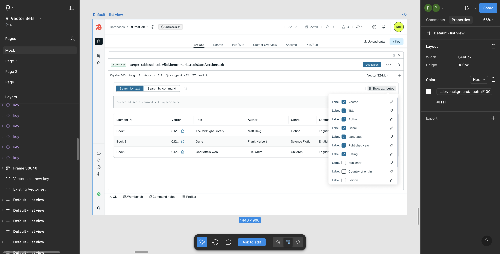

# VectorSetDetailPanel

Main container for viewing and managing a Vector Set key.



## Structure

```
VectorSetDetailPanel
├── VectorSetHeader
│   ├── KeyTypeBadge (VECTOR SET)
│   ├── Key name
│   ├── "Exit search" button (when searching)
│   └── Actions (edit, delete, expand, close)
├── VectorSetMetadata
│   ├── Key size
│   ├── Length (element count)
│   ├── Vector dim
│   ├── Quant type
│   ├── TTL
│   ├── Vector format dropdown
│   └── Add element button (+)
├── VectorSetToolbar
│   ├── "Search by text" / "Search by command" toggle
│   ├── Search input
│   ├── "Show attributes" button
│   └── Filter controls
├── CommandPreview (optional)
│   └── "Generated Redis command will appear here"
├── AddElementForm (expandable)
│   ├── Attribute dropdown
│   ├── Value input
│   ├── Raw/JSON toggle
│   └── Add/Cancel buttons
├── AttributeColumnSelector (side panel)
│   └── Checkbox list of attributes
└── VectorSetElementsTable
    ├── Column headers (Element, Vector, [Attributes])
    └── Virtualized rows
```

## States from Figma

| Figma Frame | Description |
|-------------|-------------|
| Default - list view | Base state with table |
| Key with new elements | After adding elements |
| View attributes | Showing attributes panel |
| View attributes - edit mode | Editing attributes |
| Add element - open attributes | Add form expanded |
| Add element - closed attributes | Add form collapsed attrs |
| Add element - with attributes | Form with attrs filled |
| Add element - multiple elements - scroll | Scrolling through elements |
| Open filter | Filter input visible |
| Filter autocomplete | Filter with suggestions |
| Active filter (with "score" column) | Filter applied |
| Hover | Row hover state |
| Hover when filter is active | Hover with filter |
| Delete key | Delete confirmation |
| Edit vector | Editing vector values |

## Props

```typescript
interface VectorSetDetailPanelProps {
  keyName: string
  onClose: () => void
  onRefresh: () => void
}
```

## Figma Reference

- Mock page: Multiple "Default - list view" frames showing different states
- Node: `365:47203`
